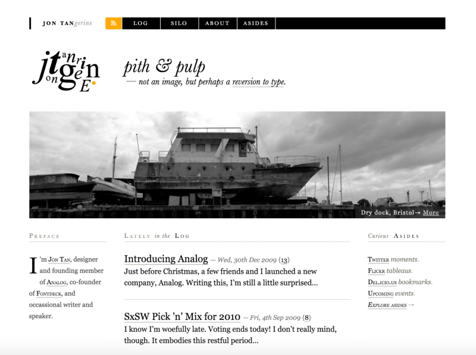
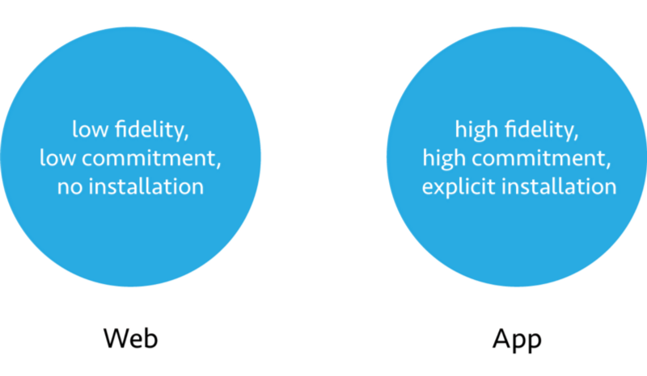

*This is sort of a response to Adam “[@mrmrs_](https://twitter.com/mrmrs_)” Morse’s “[Webfonts](http://mrmrs.io/writing/2016/03/17/webfonts/).” It’s not a rebuttal by any means, but rather a collection of my own thoughts that at least tangentially relate to his article.*

Webfonts, in theory, are great. Using them responsibly though, without negative impact on the user experience, is an engineering nightmare at best, impossible at worst.

[The FOIT, the standard way of browsers loading webfonts, is simply unacceptable](https://www.filamentgroup.com/lab/font-events.html). Instead, we’re advocating [the FOUT, or even FOFT](http://www.zachleat.com/web/critical-webfonts/). We keep trying to comfort ourselves by repeating how shuffling fonts around is _a feature, not a bug_.

And yes, progressively building up content as data flows in is a fascinating and exciting quality of the Web.

Still, the value of this feature at this point seems rather academic.

It’s just hard to imagine a user going “Wow, the whole page suddenly changed for no apparent reason. What an awesome experience!”

<blockquote class="twitter-tweet" data-lang="en">
.<a href="https://twitter.com/mrmrs_">@mrmrs_</a> FOIT and FOUT are so offensive I don&#39;t understand how any designer would be okay with using web fonts
&mdash; Brent Jackson (@jxnblk) <a href="https://twitter.com/jxnblk/status/710456292436025345">March 17, 2016</a></blockquote>

When I first read [Adam’s article](http://mrmrs.io/writing/2016/03/17/webfonts/), intriguing as it was, [it didn’t sit well with me](https://twitter.com/fredericmarx/status/710480904255315968). Of course it didn’t. It never feels good when someone tells you how something you love isn’t good for you. Especially when you know deep down that they have a point.

And if there is one thesis in this article I can wholeheartedly agree with, it’s probably this:

> System fonts **can** be beautiful.
> Webfonts are **not** a requirement for great typography.

## System fonts can be beautiful.

Before we had webfonts, building websites with the limited typographic resources available was an art form in its own right. Some designs from that time still hold up remarkably well.

<figure>

<figcaption class="imageCaption">[Jon Tan](http://jontangerine.com/)’s website in 2010 was a paragon of typographic style without webfonts.</figcaption>

</figure>

Since then, [system fonts have only gotten better](http://practicaltypography.com/system-fonts.html). Apple has continued adding beloved classics like [Avenir](https://en.wikipedia.org/wiki/Avenir_%28typeface%29), [Microsoft has come up with some quality original designs](http://typographica.org/on-typography/microsofts-cleartype-font-collection-a-fair-and-balanced-review/) and the Android system families [Roboto](https://en.wikipedia.org/wiki/Roboto) and [Droid](https://en.wikipedia.org/wiki/Droid_fonts) are among the most popular webfonts themselves.

<blockquote class="twitter-tweet" data-lang="en">
The best &quot;typography tip for UI&quot; I have for you is use system fonts.
&mdash; Brent Jackson (@jxnblk) <a href="https://twitter.com/jxnblk/status/704755241263173633">March 1, 2016</a></blockquote>

General UI elements and menus are probably the most obvious place to start using system fonts. They are what the system designers thought was best, so we might as well take their word for it instead of reinventing the wheel.

Also, the user has already bought into them by choice of OS, or is at least so accustomed that they don’t worry about them anymore.

System UI fonts are a little tricky to use, but you can read all about it in Smashing Magazine’s aptly named article [Using System UI Fonts In Web Design: A Quick Practical Guide](https://www.smashingmagazine.com/2015/11/using-system-ui-fonts-practical-guide/ "Read 'Using System UI Fonts In Web Design: A Quick Practical Guide'").

So, yes, _webfonts are not a requirement for great typography_. But does that mean we should stop using them altogether?

## When should we use webfonts?

All of this shouldn’t lead us to underestimate the benefits of webfonts. In [another recent essay well worth your time](https://medium.com/@yarcom/in-defense-of-homogeneous-design-b27f79f4bb87#.jcc9ui9p1), [Yaron Schoen](https://twitter.com/Yarcom) writes about embracing homogeneous design. One point brought up in the comments is that the more we work towards a shared universal design language and the more we reduce decoration, the more important type becomes as a brand differentiator.

Another aspect is the appreciation of typography as a craft. A system of carefully compiled webfonts is a great place to showcase your design prowess. But so is a Flash intro. And like Flash intros, the loading of webfonts get’s in our users’ way when it’s most inconvenient.

> “Building products in the digital space really does mean you need to let your ego go.” — [Yaron Schoen](https://medium.com/@yarcom/in-defense-of-homogeneous-design-b27f79f4bb87#.qy01pplsi)

When users first visit a website, they probably have a clear goal. They might want to read an article they were sent to on social media, look up some information from a search result or buy a product. Most of the time that goal isn’t to look at a specific typeface.

The Web is a time-based medium. As designers, it is our job to orchestrate our products according to our users’ needs over time.

We’re currently trying to present webfonts as soon as possible, without any regard for our users’ workflow. By interrupting them with our font loading shenanigans, we lose their trust in our site working properly, and it’s trust that wins return visitors.

So the question is, when, at which point in the user journey, should we introduce webfonts? When is a good time to gradually, progressively enhance the user experience?

Probably the most straightforward solution would be monitoring when a font becomes available through [Font Load Events](https://dev.opera.com/articles/better-font-face/), but only to swap it in when the user transitions from one page to another. This can also mean deferring webfont use until a user visits our site a second time.

Another, more cheeky approach could be using the [Page Visibility API](https://developer.mozilla.org/en-US/docs/Web/API/Page_Visibility_API) to apply webfonts when the user isn’t looking.

So instead of minimizing the FOUT it’s also possible to remove it altogether through technical means. But moving stylistic enhancements further down the timeline is also interesting on a conceptual level.

## Progressive fidelity

Another class of products that relies heavily on digital typography are native apps. Most of the time though, apps don’t need to care about progressive asset loading. They can just install everything right off the bat, which allows for a generous use of custom typefaces.

<figure>

https://vimeo.com/157259335

<figcaption class="imageCaption">The [Viki Wikipedia reader app](http://viki-app.com/) shines through its use of custom typography.</figcaption>

</figure>

Of course, hiding all content behind a tiresome installation routine is a terrible idea on the Web. But the Web “[doing everything native can and fast](https://twitter.com/jaffathecake)” is a well examined problem and the strategies used by developers and browser vendors to bridge the gap are also interesting from a design perspective.

<figure>

</figure>

For the sake of this argument, let’s look at the Web as a medium that offers information and services at a low level of commitment and pays for low friction availability with it’s lack of visual fidelity. Native apps, on the other hand, offer high fidelity but the threshold of commitment to using them is much higher through the requirement of explicit installation.

The challenge of progressive web app technology is to gradually elevate a product from a state of low friction and high discoverability to the rich experience and home screen familiarity that native apps provide.

There is a number of upcoming browser APIs aimed at standardising this kind of transition. Most notably, [Service Workers](https://developer.mozilla.org/en-US/docs/Web/API/Service_Worker_API) provide a way in which progressive web apps can install additional features, like offline capabilities, after the initial contact with the user.

We can go even further by using a _manifest.json_ file, so when users repeatedly show interest in our product, the browser can [ask them to add it to their home screen](https://developer.chrome.com/multidevice/android/installtohomescreen) and provide other privileges associated with native apps.

Communicating this process of increasing familiarity to our users is a great design opportunity. In his previously mentioned article, Yaron calls digital product design “[a conversation framework between a human and a computer](https://medium.com/@yarcom/in-defense-of-homogeneous-design-b27f79f4bb87#.amt7re2a6).” Negotiating commitment is an important part of that conversation.

Sustainable product design is about forming a relationship with our audience over time. Users will appreciate our efforts to make them more comfortable if they come in the right dose at the right moment.

This is why I think webfonts will last.
